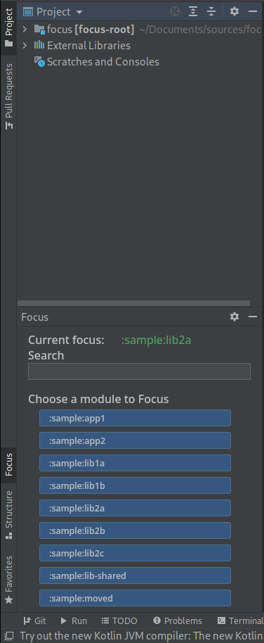

# Dropbox Focus IntelliJ Plugin [WIP]


[](https://plugins.jetbrains.com/plugin/PLUGIN_ID)
[](https://plugins.jetbrains.com/plugin/PLUGIN_ID)

<!-- Plugin description -->
[**Source code**](https://github.com/DevSrSouza/dropbox-focus-intellij-plugin/) [**Screenshots**](https://github.com/DevSrSouza/dropbox-focus-intellij-plugin/#Screenshots)

This IntelliJ and Android Studio Plugin provide tooling for Gradle Plugin [Focus by Dropbox](https://github.com/dropbox/focus).
The reason is to make it easy to switch focus and preventing open a big project without giving you the option to only select the module that you want to work on.

- When plugin detect that the project that is being open was Focus plugin, it will prompt a Dialog to Select if you want to select a Module to Focus, Clear current Focus or just leave as it is.
- Focus on a Module by right-clicking on a Module folder and selecting "Focus on Module"
- Clearing current focus by right-clicking on root project folder

How the Plugin works by Steps:
- Resolve the Focus Plugin configuration from your project by reading your `settings.gradle[.kts]` and looking for a `plugins { id("com.dropbox.focus") }` declaration.
- Resolve Focus Gradle plugin configuration if there is one by reading `focus {}`(Groovy) or `configure<com.dropbox.focus.FocusExtension> {}`(Kotlin DSL), and it will read properties `allSettingsFileName` and `focusFileName`, if it does not have one of the property or even the configuration block, it will use the default configurations values of the Focus Gradle plugin.
- Resolve all the modules names and directories from `allSettingsFileName`.
- Resolve if there is currently a Focus available by reading `focusFileName` if exists.

Resolution limitations:
All the gradle files resolution requires to be to use Literal Strings inside expected blocks. Do not create a variable and pass to it, for example:

```groovy
plugins {
  val focusVersion = "0.4.0"
  id("com.dropbox.focus") version focusVersion
}
```

Here is a working example:

Groovy:

```groovy
plugins {
  id("com.dropbox.focus") version "0.4.0"
}

focus {
  allSettingsFileName = "settings-all.gradle.kts"
  focusFileName = ".focus"
}
```

Kotlin:
```kotlin
plugins {
  id("com.dropbox.focus") version "0.4.0"
}

configure<com.dropbox.focus.FocusExtension> {
  allSettingsFileName.set("settings-all.gradle.kts")
  focusFileName.set(".focus")
}
```
 
<!-- Plugin description end -->

### Screenshots





### TODO v1

- [X] Focus tool window listing all possible focus modules</br>
- [X] Support project dir change on `allSettingsFileName`, ex: `project(":sample:moved").projectDir = file("sample/lib-moved")`. Currently, by not supporting this, we can't properly show the `Focus on Module` on Module that did change their `projectDir`.
- [X] Support Gradle Sync also on Android Studio Canary version.
- [X] Disable Dialog on startup with a checkbox, persist per project.
- [X] Focus project settings
- [X] Cache Current Focus Settings and update it by listening to Gradle Syncs

### Future Ideas
- [ ] Focus Project View
- [ ] Favorites focus, a way for easily show Focus Modules on top that you most work on.

## Building

Just run the gradle task in terminal: `./gradlew buildPlugin`. The plugin will be available in `/build/distributions/`

## Installation

- Using IDE built-in plugin system:
  
  <kbd>Settings/Preferences</kbd> > <kbd>Plugins</kbd> > <kbd>Marketplace</kbd> > <kbd>Search for "Dropbox Focus"</kbd> >
  <kbd>Install Plugin</kbd>
  
- Manually:

  Download the [latest release](https://github.com/DevSrSouza/dropbox-focus-intellij-plugin/releases/latest) or [build your self](#Building) and install it manually using
  <kbd>Settings/Preferences</kbd> > <kbd>Plugins</kbd> > <kbd>⚙️</kbd> > <kbd>Install plugin from disk...</kbd>


---
Plugin based on the [IntelliJ Platform Plugin Template][template].

[template]: https://github.com/JetBrains/intellij-platform-plugin-template
